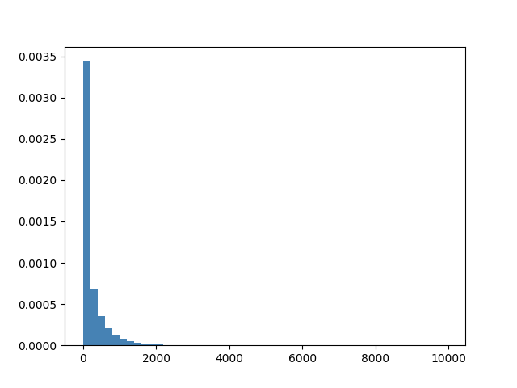
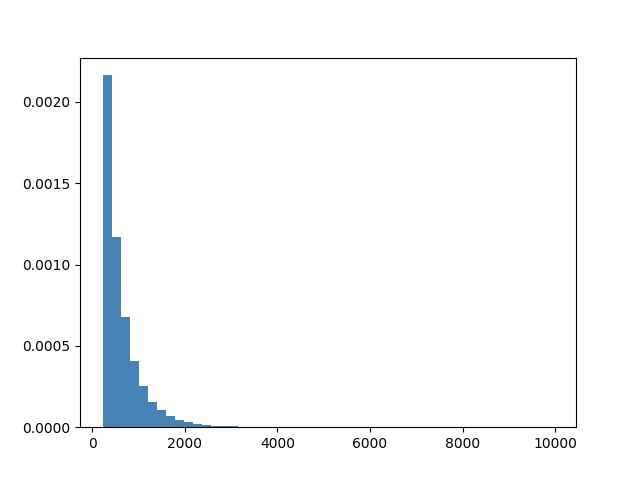

# 知乎数据分析

[TOC]

## 进度安排

- 7.17-7.17：数据下载与观察
- 7.18-7.19：数据清洗，参考kdd网站提醒；
    - 确定用户画像的目标或其他可展示的结果，亦即大实验目标
    - 确定代码框架。
- 7.20：开始工程代码编写。

## 数据清洗

###数据清洗格式

| user_info.txt     | 用户ID     | 回答被点赞数 | 回答被评论数           | 所在市       | 关注话题数 | 关注话题列表     |              |                |              |
| ----------------- | ---------- | ------------ | ---------------------- | ------------ | ---------- | ---------------- | ------------ | -------------- | ------------ |
| question_info.txt | 问题 id    | 问题创建时间 | 答案数                 | 关注数       | 邀请数     | 评论数           | 标题         | 绑定话题列表   |              |
| question_id.dict  | 短ID       | 长ID         |                        |              |            |                  |              |                |              |
| answer_id.dict    | 短ID       | 长ID         |                        |              |            |                  |              |                |              |
| topic_infos.txt   | 话题 ID    | 话题 Name    | 话题的描述             |              |            |                  |              |                |              |
| candidate.txt     | Q/A(全为A) | 文章ID       |                        |              |            |                  |              |                |              |
| answer_infos.txt  | 答案 ID    | 对应问题ID   | 是否匿名回答           | 作者         | 创建时间   | 答案被赞同的次数 | 答案的评论数 | 答案的文本信息 | 绑定话题列表 |
| training_set.txt  | 用户 ID    | 文章 ID      | 用户与其他文章的交互数 | 文章交互信息 |            |                  |              |                |              |

其中源数据只有TrainingSet,AnswerInfo,UserInfo需要清洗，别的数据格式保持一致。

### TrainingSetPrep

清洗测试集数据training_set.txt，得到如下数据格式：
```
    用户ID    文章ID    交互数    交互信息
```

- 过滤了**不合法**的数据（数据集中有个别数据有行数撕裂、缺少数据项等问题）
- 过滤了**交互数为0**的数据
- 用户数可能有重合，但pair(用户ID,文章ID)是**唯一**的。
- 交互信息只留下了所有的A标签，这是由于Q与A的比例大致为1:8，而Q中大量数据在A中出现，故不作考虑。
- 交互信息的时间戳被去掉，不作考虑。
- 最终交互信息形如：docID1,docID2,docID3,...
- 原数据规模73.1G，清洗后26.1G


### AnswerInfoPrep

清洗测试集数据answer_infos.txt，得到如下数据格式：
```
    答案 ID    对应问题ID    是否匿名回答    作者    创建时间    答案被赞同的次数    答案的评论数    答案的文本信息    绑定话题列表
```

- 过滤了**不合法**的数据（数据集中有个别数据有行数撕裂、缺少数据项等问题）
- 这部分的任务主要是原数据不需要的杂项太多，占据主要空间的文本内容并不做删除，所以数据规模基本不变。
- 原数据规模**3.3G**，清洗后**3.1G**

### UserInfoPrep

清洗测试集数据user_infos.txt，得到如下数据格式：
```
    用户ID    回答被点赞数    回答被评论数    所在市    关注话题数    关注话题列表
```

- 过滤了**不合法**的数据（数据集中有个别数据有行数撕裂、缺少数据项等问题）
- 原数据规模**5.1G**，清洗后**4.4G**
>>>>>>> ea970359fd4f2ca5d453b552b921ef032ab9759a

## 数据量

- 用户总数：713w。训练集中出现的用户数：648w。从训练集获知用户查看答案的次数最高9958，最低1次。访问频率为daily的用户241w。
- 训练集大小：2400w行。每行大约几十条交互信息。单个用户需要对浏览内容去重。
- 答案总数：134w
- 问题总数：46w
- 话题总数：11w


## 用户特征提取

根据训练集中给出的交互行为，抽取出用户在一段时间内所有的浏览历史，DeduplicateUserInteraction是一个mapreduce过程，负责将用户的交互聚类并去重，去重之后所有用户的所有交互数在几亿量级。此过程的结果保存为SequenceFile的形式：

````
用户ID	answer1,answer2,...
````

其中为了压缩大小，answer的ID使用短编码，短编码与原始编码的转换关系见answer_id.dict中，结果文件14G。

内容网站的用户使用频率不同，在用户信息中本来存在其访问频率的信息，以"weekly","daily"的形式给出。我们认为这仅供粗略分析，还需要观察用户的实际活跃程度，这可以分析用户的行为得出。经过统计用户的交互数（SumUserInteractions），我们发现了如下特征：

- 用户交互的分布不均匀，最高交互数达到9900+，最低为0，平均227次，中位数88次。有记录的用户为648w。

  

- 如果只计算平均数以上的用户，分布依然不均，平均次数622，人数为189w。

  

因答案和话题的长编码浪费空间，全部采用短编码重新index，话题和答案的短编码不在同一空间。然后使用Answer2Topic这个mapreduce过程提取答案对应的话题列表，并全部以短编码表示，这部分虽然也能用python做，但是使用分布式速度显著变快。结果格式如下：

```
Answer ID(短码)	Topic1(短码),Topic2(短码),...	
```

采用短编码能显著压缩结果大小，约为33M。然后以此为cache文件，以DeduplicateUserInteraction的结果作为输入，并对相关话题的浏览次数排序，得到如下16.8G的用户近期兴趣分布：

````
UserID	话题1 次数,话题2 次数, ...
````

每个用户都有很多浏览次数为1的话题，相比多次浏览的话题，为了提高效率，可以忽略。